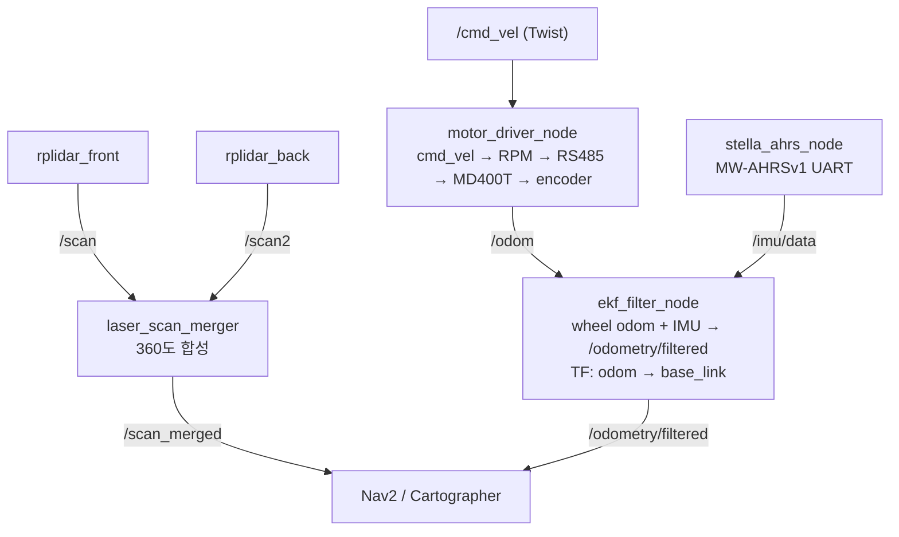
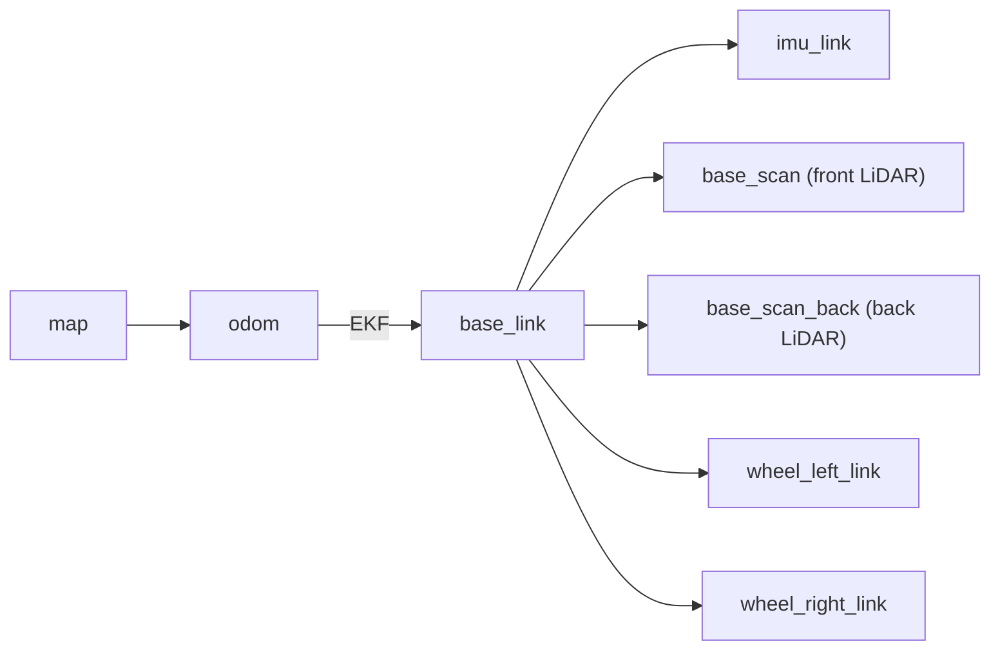

# Sendbooster AGV Bringup

ROS2 Humble 기반 Sendbooster AGV 실제 로봇 통합 런치 패키지

## 개요

이 패키지는 Sendbooster AGV의 모든 하드웨어를 한 번에 실행하는 통합 bringup 패키지입니다.
모터 드라이버(MDROBOT MD400T), AHRS IMU, EKF 센서 융합, 듀얼 LiDAR(RPLIDAR A2M8), Cartographer SLAM, Nav2 네비게이션을 지원합니다.

## 시스템 아키텍처



## TF 트리



## 의존 레포지토리

| 레포지토리 | 설명 | 링크 |
|-----------|------|------|
| **sendbooster_agv_bringup** | 실제 로봇 통합 런치 (이 패키지) | [GitHub](https://github.com/SeongminJaden/sendbooster_agv_bringup) |
| **2th_NtrexAHRS_lib_ROS_Sendbooster** | AHRS IMU 드라이버 (stella_ahrs) | [GitHub](https://github.com/SeongminJaden/2th_NtrexAHRS_lib_ROS_Sendbooster) |
| **sendbooster_agv_simulation** | 시뮬레이션 + URDF 모델 | [GitHub](https://github.com/SeongminJaden/sendbooster_agv_simulation) |
| **serial-ros2** | ROS2 시리얼 통신 라이브러리 | [GitHub](https://github.com/RoverRobotics/serial-ros2) |

## 패키지 구조

```
sendbooster_agv_bringup/
├── CMakeLists.txt
├── package.xml
├── README.md
├── config/
│   ├── ekf.yaml                    # EKF 센서 융합 설정
│   ├── nav2_params.yaml            # Nav2 네비게이션 파라미터
│   ├── cartographer_base.lua       # Cartographer 공통 설정
│   ├── cartographer_1lidar.lua     # 1 LiDAR용
│   ├── cartographer_2lidar.lua     # 2 LiDAR용
│   └── motor_params.yaml           # 모터 파라미터 예제
├── include/sendbooster_agv_bringup/
│   └── motor_driver.hpp
├── launch/
│   ├── bringup.launch.py           # 통합 런치 (모터+IMU+EKF+LiDAR)
│   └── cartographer.launch.py      # Cartographer SLAM
├── scripts/
│   └── detect_baudrate.py          # Baudrate 자동 감지
└── src/
    ├── motor_driver.cpp            # RS485 시리얼 통신
    ├── motor_driver_node.cpp       # 모터 드라이버 ROS2 노드
    └── laser_scan_merger.cpp       # 듀얼 LiDAR 스캔 합성
```

## 새 컴퓨터 설치 가이드

### 1. 시스템 패키지 설치

```bash
sudo apt update
sudo apt install -y \
  ros-humble-rplidar-ros \
  ros-humble-robot-localization \
  ros-humble-robot-state-publisher \
  ros-humble-cartographer-ros \
  ros-humble-nav2-bringup \
  ros-humble-topic-tools \
  ros-humble-teleop-twist-keyboard
```

### 2. 워크스페이스 구성

```bash
mkdir -p ~/ros2_ws/src
cd ~/ros2_ws/src

# 필수 패키지 클론
git clone https://github.com/RoverRobotics/serial-ros2.git
git clone https://github.com/SeongminJaden/sendbooster_agv_bringup.git
git clone -b ver_2.0 https://github.com/SeongminJaden/2th_NtrexAHRS_lib_ROS_Sendbooster.git
git clone https://github.com/SeongminJaden/sendbooster_agv_simulation.git
```

### 3. 빌드

```bash
cd ~/ros2_ws
source /opt/ros/humble/setup.bash
rosdep install --from-paths src --ignore-src -r -y
colcon build
source install/setup.bash
```

### 4. 환경 설정

```bash
echo "source ~/ros2_ws/install/setup.bash" >> ~/.bashrc
```

## 사전 점검 리스트

### 하드웨어 연결 확인

```bash
# 연결된 시리얼 장치 목록
ls /dev/ttyUSB* /dev/ttyACM*

# 각 장치 식별 (Vendor/Product ID 확인)
udevadm info -a /dev/ttyUSB0 | grep -E "idVendor|idProduct|serial"
```

### 시리얼 권한

```bash
# 현재 사용자를 dialout 그룹에 추가 (영구적, 재로그인 필요)
sudo usermod -aG dialout $USER

# 즉시 테스트용 (임시)
sudo chmod 666 /dev/ttyUSB*
```

### udev 규칙 설정 (포트 고정)

USB 장치는 연결 순서에 따라 포트 이름이 변합니다. udev 규칙으로 고정하세요.

```bash
sudo nano /etc/udev/rules.d/99-sendbooster-agv.rules
```

```
# Motor Driver (Silicon Labs CP210x) - serial 값은 본인 장치에 맞게 변경
SUBSYSTEM=="tty", ATTRS{idVendor}=="10c4", ATTRS{idProduct}=="ea60", ATTRS{serial}=="YOUR_SERIAL", SYMLINK+="motor_driver", MODE="0666"

# AHRS IMU
SUBSYSTEM=="tty", ATTRS{idVendor}=="YOUR_VID", ATTRS{idProduct}=="YOUR_PID", ATTRS{serial}=="YOUR_SERIAL", SYMLINK+="ahrs_imu", MODE="0666"

# Front LiDAR (RPLIDAR A2M8)
SUBSYSTEM=="tty", ATTRS{idVendor}=="10c4", ATTRS{idProduct}=="ea60", ATTRS{serial}=="YOUR_SERIAL", SYMLINK+="rplidar_front", MODE="0666"

# Back LiDAR (RPLIDAR A2M8)
SUBSYSTEM=="tty", ATTRS{idVendor}=="10c4", ATTRS{idProduct}=="ea60", ATTRS{serial}=="YOUR_SERIAL", SYMLINK+="rplidar_back", MODE="0666"
```

```bash
sudo udevadm control --reload-rules && sudo udevadm trigger

# 확인
ls -la /dev/motor_driver /dev/ahrs_imu /dev/rplidar_front /dev/rplidar_back
```

### 포트 매핑 확인

bringup.launch.py의 기본 포트 설정:

| 장치 | 기본 포트 | launch 인자 |
|------|----------|------------|
| Motor Driver | `/dev/motor_driver` | (launch 파일 내 고정) |
| AHRS IMU | `/dev/ttyUSB0` | (launch 파일 내 고정) |
| Front LiDAR | `/dev/rplidar_front` | `lidar_front_port:=` |
| Back LiDAR | `/dev/rplidar_back` | `lidar_back_port:=` |

## 사용법

### 기본 실행

```bash
# 2 LiDAR (기본) - 모든 하드웨어 한 번에 실행
ros2 launch sendbooster_agv_bringup bringup.launch.py

# 1 LiDAR (전방만)
ros2 launch sendbooster_agv_bringup bringup.launch.py num_lidars:=1

# LiDAR 포트 지정
ros2 launch sendbooster_agv_bringup bringup.launch.py \
  lidar_front_port:=/dev/ttyUSB1 \
  lidar_back_port:=/dev/ttyUSB2
```

### Cartographer SLAM (지도 생성)

```bash
# bringup 먼저 실행 (별도 터미널)
ros2 launch sendbooster_agv_bringup bringup.launch.py

# Cartographer 실행
ros2 launch sendbooster_agv_bringup cartographer.launch.py

# 1 LiDAR 모드
ros2 launch sendbooster_agv_bringup cartographer.launch.py num_lidars:=1

# Rviz 없이
ros2 launch sendbooster_agv_bringup cartographer.launch.py use_rviz:=false
```

지도 저장:
```bash
ros2 run nav2_map_server map_saver_cli -f ~/maps/my_map
```

### Nav2 네비게이션

```bash
# bringup 먼저 실행 (별도 터미널)
ros2 launch sendbooster_agv_bringup bringup.launch.py

# Nav2 실행
ros2 launch nav2_bringup bringup_launch.py \
  use_sim_time:=False \
  params_file:=$(ros2 pkg prefix sendbooster_agv_bringup)/share/sendbooster_agv_bringup/config/nav2_params.yaml \
  map:=~/maps/my_map.yaml
```

### 텔레옵 테스트

```bash
ros2 run teleop_twist_keyboard teleop_twist_keyboard
# i: 전진, ,: 후진, j: 좌회전, l: 우회전, k: 정지
```

## 단계별 테스트 가이드

한 번에 모든 것을 실행하기 전에 개별 노드를 순서대로 테스트하세요.

### 1단계: 모터 드라이버

```bash
ros2 run sendbooster_agv_bringup motor_driver_node --ros-args \
  -p serial_port:=/dev/motor_driver -p baudrate:=19200

# 확인
ros2 topic echo /odom --once
ros2 topic hz /odom                  # 50Hz
```

### 2단계: AHRS IMU

```bash
ros2 run stella_ahrs stella_ahrs_node --ros-args \
  -p port:=/dev/ttyUSB0 -p baud_rate:=115200

# 확인
ros2 topic echo /imu/data --once
ros2 topic hz /imu/data
```

### 3단계: 통합 bringup

```bash
ros2 launch sendbooster_agv_bringup bringup.launch.py

# 토픽 확인
ros2 topic list
ros2 topic hz /odometry/filtered     # 50Hz (EKF 출력)
ros2 topic hz /scan_merged           # LiDAR 주파수

# TF 트리 확인
ros2 run tf2_tools view_frames       # frames.pdf 생성
ros2 run tf2_ros tf2_echo odom base_link
```

### 4단계: 주행 테스트

```bash
ros2 run teleop_twist_keyboard teleop_twist_keyboard

# Rviz에서 확인할 것:
# - 전진/후진 방향이 맞는지
# - 회전 방향이 맞는지
# - 1m 전진 시 오도메트리도 약 1m 이동하는지
# - 360도 회전 시 오도메트리도 한 바퀴 도는지
```

## 오도메트리 캘리브레이션

주행 테스트에서 오차가 큰 경우 아래 파라미터를 조정하세요 (launch 파일 내):

| 파라미터 | 기본값 | 설명 | 조정 방법 |
|---------|--------|------|----------|
| `wheel_radius` | 0.0965 | 바퀴 반지름 (m) | 직진 거리 오차 시 조정 (마모되면 줄어듦) |
| `wheel_separation` | 0.37 | 바퀴 간 거리 (m) | 회전 각도 오차 시 조정 |
| `encoder_resolution` | 6535 | 엔코더 해상도 | 직진 거리 오차 시 조정 |

## 로봇 스펙

| 항목 | 값 |
|------|-----|
| 구동 방식 | 차동 구동 (Differential Drive) |
| 모터 드라이버 | MDROBOT MD400T |
| 기어비 | 1:10 |
| 바퀴 지름 | 193mm |
| 바퀴 간격 | 370mm |
| LiDAR | RPLIDAR A2M8 x2 (전방 + 후방) |
| LiDAR 범위 | 0.15m ~ 12m |
| IMU | NTRexLAB MW-AHRSv1 |
| 통신 | RS485 (모터), UART (IMU, LiDAR) |

## ROS2 토픽

### Published Topics

| Topic | Type | 발행 노드 | 설명 |
|-------|------|----------|------|
| `/odom` | nav_msgs/Odometry | motor_driver_node | 휠 오도메트리 |
| `/imu/data` | sensor_msgs/Imu | stella_ahrs_node | IMU 데이터 |
| `/odometry/filtered` | nav_msgs/Odometry | ekf_filter_node | EKF 융합 오도메트리 |
| `/scan` | sensor_msgs/LaserScan | rplidar_front | 전방 LiDAR |
| `/scan2` | sensor_msgs/LaserScan | rplidar_back | 후방 LiDAR |
| `/scan_merged` | sensor_msgs/LaserScan | laser_scan_merger / relay | 합성 스캔 (360도) |

### Subscribed Topics

| Topic | Type | 구독 노드 | 설명 |
|-------|------|----------|------|
| `/cmd_vel` | geometry_msgs/Twist | motor_driver_node | 속도 명령 |

## 통신 프로토콜 (MDROBOT RS485)

### 패킷 구조

| Byte | 내용 | 설명 |
|------|------|------|
| 0 | RMID | 수신자 ID (모터드라이버: 183) |
| 1 | TMID | 송신자 ID (PC: 184) |
| 2 | ID | 모터 ID |
| 3 | PID | 명령 ID |
| 4 | DataSize | 데이터 길이 |
| 5+ | Data | 명령별 데이터 |
| Last | Checksum | (~sum + 1) & 0xFF |

## 참고 자료

- [MD_controller (원본 모터 드라이버 프로젝트)](https://github.com/jjletsgo/MD_controller)
- [MDROBOT 공식 홈페이지](https://www.mdrobot.co.kr)
- [RPLIDAR A2M8 Datasheet](https://www.slamtec.com/en/Lidar/A2)
- [robot_localization (EKF)](https://docs.ros.org/en/humble/p/robot_localization/)
- [Cartographer ROS](https://google-cartographer-ros.readthedocs.io/)
- [Nav2 Documentation](https://docs.nav2.org/)

## 라이선스

Apache-2.0
